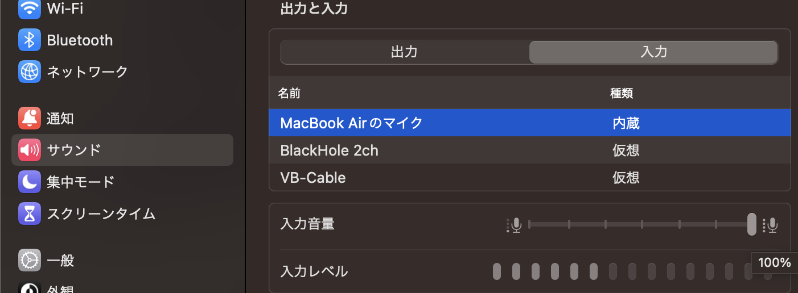

# AiAvatar 実行用 Docker環境

[aiavatarkit](https://github.com/uezo/aiavatarkit) を Docker for Mac 環境で動かす一式

# Mac の音量設定
マイクの音量を100%にしておくと音声認識しやすくなる  
システム設定 -> サウンド -> 入力と出力 -> マイクの音量を100%にする  


# PulseAudio
Macホストとコンテナ内のオーディオを繋ぐためのソフトウェア  
PulseAudioを起動した状態でDockerコンテナーを起動すると接続される   
```
# pulseaudio を設定
brew install pulseaudio

# PulseAudio を起動
pulseaudio --load=module-native-protocol-tcp --exit-idle-time=-1

# PulseAudio 起動確認
pulseaudio --check -v

# PulseAudio を停止
pulseaudio --kill

# pulseaudio デフォルトデバイスの確認
# https://wiki.archlinux.jp/index.php/PulseAudio/%E3%82%B5%E3%83%B3%E3%83%97%E3%83%AB#.E3.83.87.E3.83.95.E3.82.A9.E3.83.AB.E3.83.88.E3.81.AE.E5.85.A5.E5.8A.9B.E3.82.BD.E3.83.BC.E3.82.B9.E3.82.92.E8.A8.AD.E5.AE.9A
# http://kamae-norihiro.blogspot.com/2015/09/pulseaudio.html
# デフォルトの入力ソース確認
pacmd list-sources | grep -e 'index:' -e device.string -e 'name:'
pactl set-default-source Channel_1

# デフォルトの出力ソース
pacmd list-sinks | grep -e 'name:' -e 'index:' -e device.string -e 'name:'
pactl set-default-sink 1__2
```

# docker 
`docker compose up` 後に コンソールへのアクセスして aiavatarkit を 起動すれば 音声対話が可能  

```
# docker イメージをビルド
docker compose build
# docker compose build --no-cache

# 起動
docker compose up -d

# コンソールへのアクセス
docker compose exec aiavatar /bin/bash

# aiavatarkit 実行 後に 音声対話が可能
python run.py

# 停止
docker compose down
```